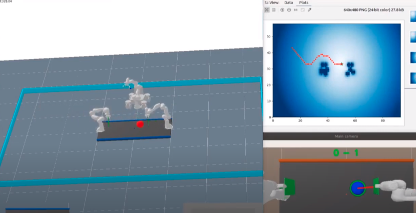

This is a Pong game played by 2 Panda robots:

This project presents:

1. 2D to 3D projection

2. Image based Visual servoing

3.Inver Kinematics with multiple objectives by stacking Jacobians

4.Path planning with Potential Fields

Result: https://www.youtube.com/watch?v=3uLs5tedoF8&t=85s

